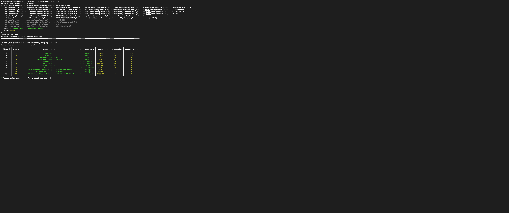
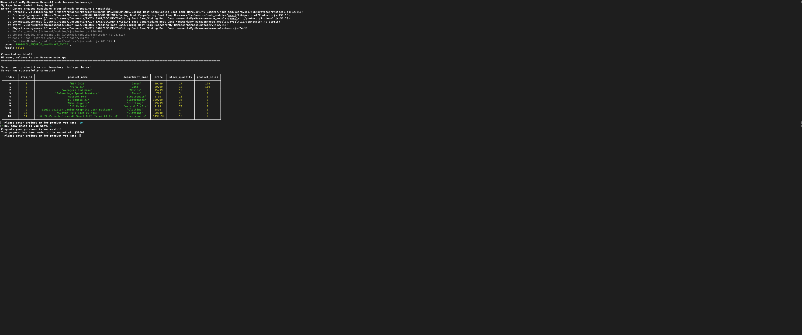
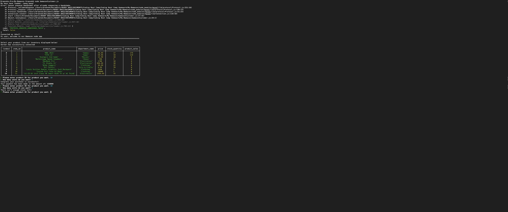

# My-Bamazon
Welcome to my Bamazon a node.js "cli" application for a storefront that can hold inventory/stock and take orders based on user requests using their command line.

<h1>NPM Packages & Technology used</h1>
:point_right: <a href=https://www.npmjs.com/package/npm>NPM install</a>
 
:point_right: <a href=https://www.npmjs.com/package/inquirer>NPM install inquirer</a>
 
:point_right: <a href=https://www.npmjs.com/package/mysql>NPM install mysql</a>
 
:point_right: <a href=https://www.npmjs.com/package/console.table>NPM install console.table</a>

 
<h3>My SQL</h3>

<h3>Visual Code</h3>

<h3>NPM</h3>

<h1>Scripts/Files used</h1>
The first file created was the customer view or the "customerBamazon.js" file!
image 1 shows the connection console.logs along with reponse message and console.table

In the second picture we have the questions being prompted by the terminal to the customer/user!

And lastly in the third picture we have the product total and purchase happening by the customer, we give you infinite money so shop on!

<h2>Manager view and Supervisor js files comming real soon</h2>
